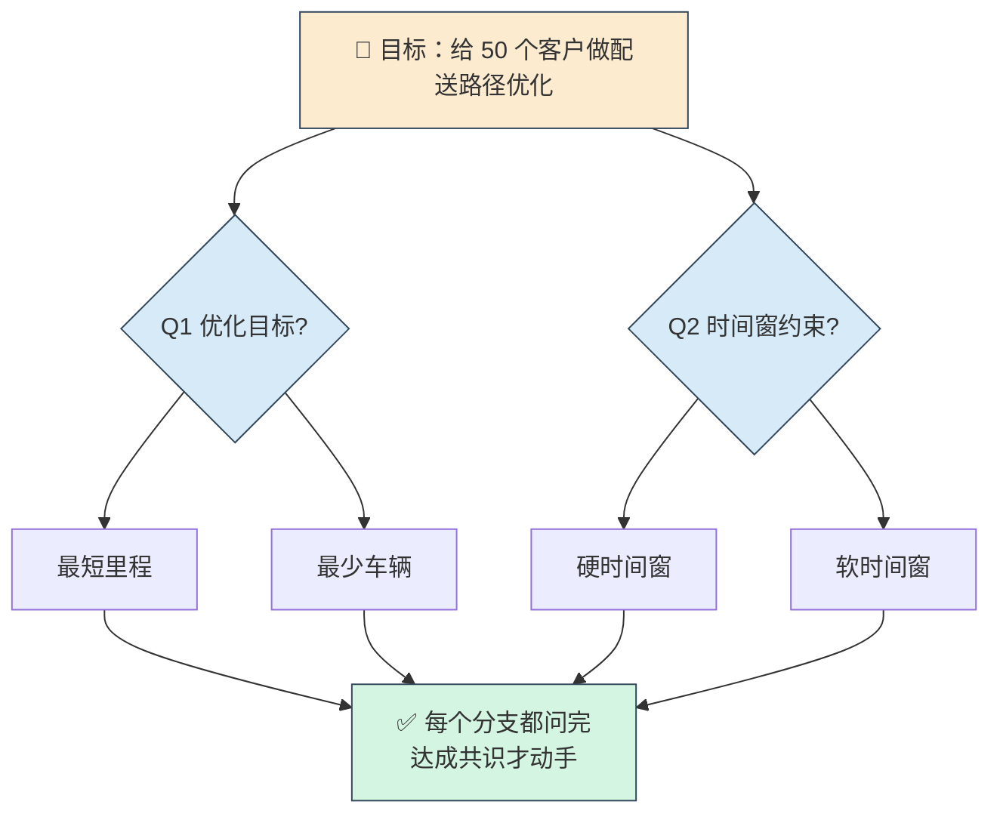

> 一句话：**在你动手建模/写代码之前，先用一个"不依不饶的面试官"把方案里的每个模糊决策都问清楚。**

想象你要做一个"配送路径优化"项目。导师或合作方只说了一句"帮我优化一下配送路线"。你要是直接埋头写 VRP 模型，十有八九会返工——因为"优化"两个字背后藏着一堆没敲定的决策：目标是最短里程还是最少车辆？时间窗是硬约束还是软约束？数据有多少客户、有没有历史订单？

**grill 系列就是帮你把这些"想当然"提前挖出来的工具。** 它会一次只问你一个问题，顺着决策树逐层追问，直到方案的每个分支都清晰了才停手。



> grill 像剥洋葱：一次只问一个问题，顺着决策树逐层挖到底。

---

## 一、这套 skill 里有哪几个？我该怎么选？

| Skill | 它是干什么的 | 什么时候用 |
|---|---|---|
| **`grill-me`** | 最轻量的纯对话追问，问完就完，不留任何文件 | 大多数情况的首选：快速验证一个想法、讨论一个方案 |
| **`grilling`** | 底层"发动机"，真正的追问逻辑都在这 | 一般不用直接管，`grill-me` 会自动调用它 |
| **`grill-with-docs`** | 追问的同时，把决策记成 ADR（架构决策记录）和术语表 | 已有代码库、想把讨论过程留档时用 |
| **`wayfinder`** | 项目太大、一次聊不完时，把大项目拆成一张"决策地图" | 全新的大课题、毕业设计开题 |
| **`batch-grill-me`** | 一次性批量追问好几个方案 | 实验性，暂可忽略 |

> **简而言之：`grill-me` 是入口**

---

## 二、怎么触发它？

| 方式 | 你输入 | 效果 |
|---|---|---|
| **手动（推荐）** | `/grill-me` 然后说你的方案 | 立即开始追问 |
| **自动** | 直接说 "grill 我这个方案"、"帮我拷问下这个设计" | 模型识别到"grill"触发词会自动调用 |

> ⚠️ 注意：`grill-me` 本身设了"只手动触发"，所以最稳妥的方式就是**先打 `/grill-me`**，再描述你的方案。

---

## 三、一次完整的 grill 长什么样？（运筹实战）

假设你有个模糊想法，你这样开启：

```
/grill-me 我想做一个"考虑时间窗的快递配送路径优化"，
用遗传算法求解，请 grill 我这个方案。
```

接下来它会**一次只问一个问题**，而且**每个问题都会附上它的推荐答案**，你只需确认或修改：

```
Q1：优化目标是什么？
   我的推荐：以"总行驶里程最短"为主目标。
   选项：A. 最短里程  B. 最少车辆数  C. 两者加权  D. 其它
👉 你：选 A
```

```
Q2：客户的时间窗是硬约束（超时就不行）还是软约束（超时罚钱）？
   我的推荐：软约束 + 惩罚系数，更符合快递实际。
👉 你：同意，但惩罚系数还没定
```

```
Q3：惩罚系数怎么定？（这正是你刚才留的尾巴——它会追着问到底）
👉 ……
```

> **关键体验**：它不会一次甩给你 20 个问题把你淹没；也不会自己跑去查代码/查数据然后自问自答。**事实**（比如"这个数据集有多少客户"）它自己去查，**决策**（比如"目标选哪个"）一定留给你拍板。

**什么时候结束？** 当它判断"所有分支都问清了"，会**停下来等你确认**，绝不自作主张开始写代码：

```
方案已经清晰：硬目标=最短里程，软时间窗+惩罚，数据用 Solomon 基准。
确认我们可以开始了吗？（你确认前我不会动手）
```

---

## 四、使用建议

1. **建模前必先 grill。** 运筹里 80% 的返工来自"约束没想清楚"。先用 grill 把"目标、约束、数据、算法"四类决策问透，再写模型，能省大量回头路。

2. **不知道怎么答就选它的推荐。** 每个问题都有推荐答案，你完全可以"先认可、后修正"——它的推荐通常是该领域的常见做法（比如时间窗默认软约束），比你从零想快得多。

3. **大课题用 wayfinder 拆。** 如果是"毕业设计：城市物流网络优化"这种一次聊不透的大题，别硬用 grill-me，改用 `/wayfinder` 把它拆成一个个小决策逐个攻破。

---

## 五、一句话总结

> **grill 系列 = 建模/写码前的"需求拷问官"。**
> 它用"一次一问 + 推荐答案"的方式，顺着决策树把你方案里每个模糊点都问清楚，**你确认共识之前它绝不动手**。运筹新手只需记住：建模前先 `/grill-me`，把"想当然"提前挖出来。
