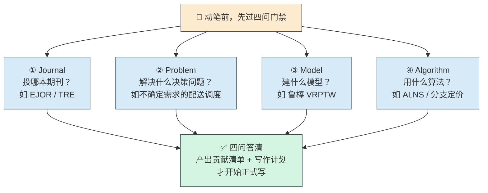
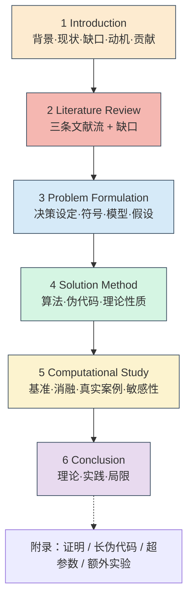

> 一句话：**专门帮你写、改、打磨"运筹学（OR）论文"的私人写作教练**，目标期刊是 TRE、EJOR、COR、OMEGA、Transportation Science、INFORMS 这类运筹/管理科学期刊。

运筹论文有它自己的"套路"：一个真实决策问题 → 数学模型 → 求解算法 → 计算实验，四个环节环环相扣，审稿人专挑这四环里的断裂处。这个 skill 把这套套路和审稿人的"雷区"都内置了，你照着走就行。


> OR 论文 = 一条不断裂的论证链：问题 → 模型 → 算法 → 证据，环环相扣。

---

## 一、它能帮你做哪几件事？

你开口时先想清楚你要哪一类帮助，它会按类处理：

| 任务类型 | 你大概会这样说 |
|---|---|
| **搭骨架（Architecture）** | "帮我设计一篇 OR 论文的大纲和章节结构" |
| **写初稿（Drafting）** | "帮我写摘要 / 引言 / 模型部分" |
| **改稿（Revision）** | "帮我把这篇稿子重组得更像期刊论文" |
| **润色（Polishing）** | "帮我把中式英语改成学术英语"、"去掉 AI 味" |
| **审查（Audit）** | "帮我检查贡献和证据对不对得上、引用有没有问题" |

---

## 二、怎么调用它？说人话就行

先纠正一个常见误解：**你不需要背任何"标准 prompt 格式"，也不用刻意打 skill 名。**

这个 skill 的官方说明（仓库 README）里写得很清楚：

> 正常使用中，你**不需要**提及 skill 的名字。只要你的请求是关于 OR 论文的结构、润色、修改、贡献对齐或投稿准备，就足够触发它。

也就是说，**直接用大白话说你要做什么**就行。官方给出的调用示例，都是这种朴素短句：

```
帮我润色这段 OR 论文的引言
帮我重构我这篇路径优化（routing）论文的结构
帮我为这个模型写计算实验（computational study）部分
帮我审查贡献和实验是否对得上
把这段中文 OR 摘要翻译成期刊风格的英文
帮我为算法流程图和消融图设计英文图题
帮我准备投 Elsevier 某 OR 期刊的 highlights 和 cover letter
```

两种触发方式都可以：

| 方式 | 怎么做 | 说明 |
|---|---|---|
| **直接说需求（推荐）** | 像上面那样描述任务 | 命中它的 description 就会自动调用，无需记命令 |
| **显式点名** | 句首加 `/or-writing-polishing` | 想强制确保用它时这么写，更保险 |

> 💡 **唯一要记住的一点**：写**整篇**论文时，它会先问你四个问题（见下面"四问门禁"）。所以你开口时只要把"期刊 + 大致方向"说清楚就够了，**剩下的它会主动来问你**，不用一次性把所有细节报齐。

---

## 三、第一道门：四问门禁

让它写**整篇**论文时，它**不会马上动笔**，而是先一次性问你四个问题：



> 你可以一次性回答，也可以让它先扫一眼你的项目文件夹（数据、代码、已有草稿）**给出推荐答案你再确认**。四问答清后，它才会产出一份"贡献清单 + 写作计划"，然后才开始写。

**为什么要这道门？** 因为运筹论文的方向（期刊偏好、模型选择、算法定位）一旦定错，后面全白写。先对齐再动笔，返工最少。

---

## 四、它会写出六段式结构

它会按运筹期刊最主流的**六段结构**组织你的论文：



| 章节 | 写什么 | 它帮你把住的关 |
|---|---|---|
| **1 引言** | 背景→现状→缺口→动机→贡献 | 缺口和贡献必须一一对应；不在引言堆数学符号 |
| **2 文献综述** | 三条流：问题/建模/算法 | 每条流末尾点出缺口，指向后文 |
| **3 问题建模** | 决策设定、符号、完整模型、假设 | 模型要"讲清楚"不只是"摆出来"；假设要论证 |
| **4 求解方法** | 算法、伪代码、理论性质 | 算法从"经典方法→前沿→你的改进"讲清来龙去脉 |
| **5 计算研究** | 基准对比、消融、真实案例、敏感性 | 第一节必须是"实验设置"；随机算法至少 10 个随机种子 |
| **6 结论** | 理论意义、实践意义、局限 | 不简单重复摘要；局限要诚实 |

附录放：证明、长伪代码、超参数、额外实验。

---

## 五、一次典型使用流程

假设你做了一个"考虑随机需求的鲁棒配送路径优化"课题，想写成论文投 EJOR。

**第 1 步：开题（搭骨架）**

用一句大白话说清你的方向即可，不用刻意报齐四问：

```
帮我写一篇投 EJOR 的 OR 论文：
做的是随机需求下的鲁棒配送路径优化，
打算用两阶段鲁棒 VRPTW 模型，配一个改进的 ALNS 算法。
```

它会先扫你的文件夹、顺着你的话把四问确认清楚（缺哪问它会主动补问），然后给出大纲和贡献清单。

**第 2 步：分段写初稿**
```
先帮我写第 3 节「问题建模」
```
它会写出带决策变量、目标函数、约束、假设论证的完整建模部分，并配一个可手算的小算例。

**第 3 步：写算法和实验**
```
写第 4 节算法（含伪代码），再写第 5 节实验设计
```
实验部分它会坚持：先写"计算环境与数据设置"，再才是结果；基准、消融、真实案例分层清楚。

**第 4 步：润色 + 审查**
```
全文润色，去掉中式英语和 AI 味；
再做一次审查：贡献和证据是否一一对应？引用是否真实？
```
这是它最硬核的部分——会逐条检查"摘要里说的每个数字，能不能从正文表格里复算出来"、"每条引用是否真实存在、DOI 对不对"。

---

## 六、它的几条"铁律"

- **贡献必须能兑现**：引言里每说一条贡献，后文必须有对应的定理/算法/表格/图/消融来支撑，缺一条就返工。
- **不许夸大**：摘要里的每个百分比提升，都要能从正文表格复算出来。
- **不许自我拆台**：删掉"我们的方法不是全面占优"这类作者心虚的元评论，改成直接报告事实。
- **引用必须真实**：绝不编造作者、年份、DOI；投期刊前强制跑一遍"引用完整性审计"。
- **实验要公平**：随机启发式算法对比至少 10 个种子，报均值±标准差和统计检验。

---

## 七、使用建议

1. **先想清楚四问再开口。** 期刊、问题、模型、算法这四个答案越具体，它给你的大纲越准。不确定就先让它扫你的文件夹给推荐。

2. **别指望它替你"造"结果。** 它的铁律是"证据闭环"——你没有跑过的实验、没有的数据，它不会帮你编。它擅长把"你真实做出的东西"组织成审稿人认可的样子。

3. **中文草稿可直接喂给它。** 它有专门的"中式英语 → 学术英语"和"去 AI 味"能力，你先用中文把想法写顺，再让它转成发表级英文，效率最高。

---

## 八、一句话总结

> **or-writing-polishing = 运筹论文的"结构设计师 + 写作教练 + 审稿人预审员"三合一。**
> 先过"四问门禁"对齐方向，再按"六段结构"成文，全程用"贡献-证据闭环、引用真实、实验公平"三条铁律把关。运筹新手只需记住：**答清四问 → 分段让它写 → 最后让它润色+审查**，就能产出一篇符合 TRE/EJOR 水准的稿子。
